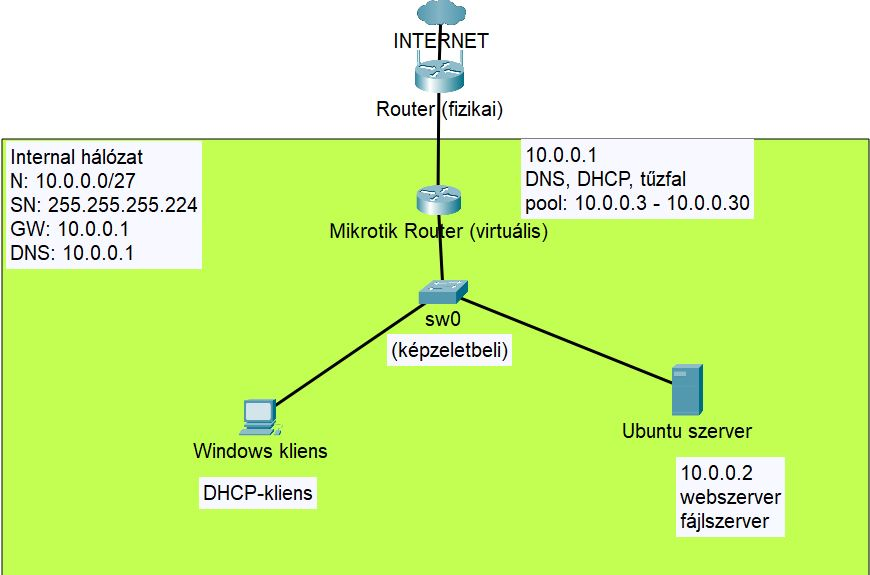
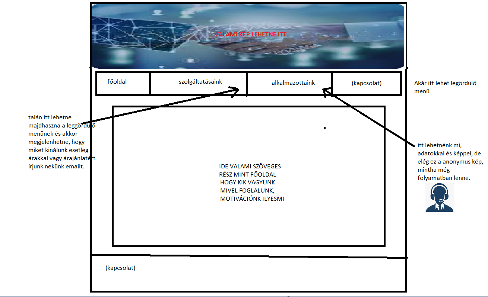

<h2> Linux fájlszerver központi felhasználó kezeléssel, webszolgáltatás honlappal, levelezés</h2>

**
Szerzők: Sipos Levente, Gajdos György és   Nagy-Tóth Bence
**

---

## Tartalomjegyzék
[Absztrakt](#abstract)
1. [Tervezés](#tervezes)
	1. [Internetszolgáltatás](#internet)
	1. [Router típusának kiválasztása](#router)
	1. [Szerver operációs rendszer típusának kiválasztása](#szerver)
	1. [Különböző webszerver-lehetőségek összehasonlítása](#web)
	1. [Router terv](#routing)
	1. [IP-címzési terv](#cimzes)
	1. [Tűzfal-beállítások](#tuzfal)
	1. [Felhasználói csoportok kialakítási terve ](#csoportok)
	1. [Fájlszerver terv](#fszerver)
	1. [Levelezőszerver terv](#mailserver)
	1. [Webszerver terv](#webterv)
	1. [Elérhető weboldalak](#weboldalak)
	1. [Használati esetek](#usecases)
2. [Megvalósítás](#implementation)
3. [Csapattagok](#tagok)

## Bevezetés  
Feladatunk a Battyhyány Lajos Gimnázium (fiktív iskola) informatikai rendszerének megteremtése. Az intézmény igazgatója tisztelt meg minket ezen munka megtervezésével és kivitelezésével. Az informatikai rendszer magában fogja foglalni egy internethálózat kiépítését, a belső hálózat megtervezését, egy fájlszerver, webszerver és egy levelezőszerver felépítését és üzemeltetését, valamint a kért kliensek és szerverek használatához szükséges operációs rendszerek telepítését, ennek megfelelő szoftveres és hardveres erőforrások biztosítását. Ezek mellett fontos, hogy az iskola hálózatát megfelelő minőségű védelemmel (tűzfal, jogosultsági rendszerek) is ellássuk.

Levelezőszolgáltatás telepítése feltétlenül szükséges, mivel korábban semmilyen levelezőszolgáltatás nem volt telepítve, a dolgozók kívánt konkrét e-mail azonosítóját az iskola gazdasági osztálya szerzi be. A szolgáltató az XYZMail. Ezt jelenleg weben érik el a `public` címen. Arra
viszont igény lenne, hogy minden kliens számítógépre kerüljön fel egy levelezőkliens, hogy így
kényelmesebb legyen a levelek kezelése.
A rendszer kiépítésekor az adatok biztonságára is kiemelt figyelmet kell fordítani. Ez
különösen fontos, hiszen személyes és egészségügyi adatokat is kezelni fog a rendszer. A
medikai adatok mentésére napi rendszerességgel van szükség, a holnap információ
adattartalmának viszont csak hetente. Elvárás továbbá, hogy minden számítógépen legyen
vírusirtó.
Az intézet a kiépítés után szeretné igénybe venni az üzemeltetési szolgáltatásunkat is,
ami az informatikai hardverek (kliens, szervergépek), a hálózat, az operációs rendszerek
felügyeletét és karbantartását, a felhasználók informatikai támogatását és a rendszerek (így a
medikai rendszer) konfigurációját is magában foglalja.

## Követelménylista 
__todo__: min. 30 követelményt felsorolni javaslat: csináljuk meg excelben, aztán utána tegyük bele ide

[Spreadsheet to markdown](https://tabletomarkdown.com/convert-spreadsheet-to-markdown/)
## 1. Tervezés 

### 1.1. Internetszolgáltatás 
A Magyarországon üzemelő internetszolgáltatók közötti választási lehetőségeket az iskola elhelyezkedése korlátozza. Ennek megfelelően két internetszolgáltatót találtunk, akiknek a környéken lefedettségük van.

A lehetőségek a következők:
Szolgáltató | Csomag | Garantált letöltési sebesség | Garantált feltöltési sebesség | Bruttó havidíj | Saját beüzemelési lehetőség | elektronikus számla (e-Pack kedvezmény)
------------|---------|------|------|-----|-----|----
Vodafone | Internet 150  | 105 Mbit/s | 7 Mbit/s | 3000 Ft/hó | van | igen
Vodafone | Internet 300  | 210 Mbit/s | 14 Mbit/s | 5000 Ft/hó | van | igen
Digi | DIGINet Növekedés 100 | 90 Mbit/s | 60 Mbit/s | 5040 Ft/hó | nincs | igen
Digi | DIGINet Növekedés 500  | 300 Mbit/s | 100 Mbit/s | 6230 Ft/hó | nincs | igen

A szolgáltató által bevezetett internetes kábelt ajánlott egy WiFi-szórásra egyaránt képes router eszközhöz csatlakoztatni, így a vezetékes hálózat mellett a vezeték nélküli hálózatot is kiépíthetünk az iskolában, amennyiben erre igény van. A vezeték nélküli hálózat lefedettsége azonban korlátozott, az előbb ismertetett Mikrotik router esetében 10 méter. Ahhoz, hogy a teljes iskola épületét lefedjük, szükség lehet bizonyos helyiségben lehetőleg szintén Mikrotik márkájú jelismétlőket, hozzáférési pontokat kihelyezni, hogy az iskola legtöbb pontján stabil jelerősséget és internetelérést kapjunk.

A fenti táblázat alapján részünkről a második lehetőség optimális lehet, ez név szerint a Vodafone Internet 300-as csomagja.

### 1.2. Router típusának kiválasztása 

Routerre azért van szükségünk, hogy az iskolai belső hálózatot az internetre csatlakoztassuk. Amennyiben egy géptermet vagy egy másik hálózati egységet szeretnénk leválasztani az internetről, természetesen erre is lehetőséget biztosít egy router. 

A választott internetszolgáltató alapértelmezés szerint biztosítana router eszközt, de ezt érdemes lemondani, mi fogjuk biztosítani ezt az eszközt.

Jelenlegi raktárkészletünknek megfelelően az alábbi eszközök közül tudnak választani:
| Router márkája | Előnyei                                                                                                          | Hátrányai                                                                                                                                                                                       |
| -------------- | ---------------------------------------------------------------------------------------------------------------- | ----------------------------------------------------------------------------------------------------------------------------------------------------------------------------------------------- |
| Cisco          | felsőbb árkategória, ipari szabvány, rengeteg leírás található a beállításához, jelentős felhasználói bázisa van | drága, inkább nagyvállalati környezetben ajánlatos telepíteni, beállítása parancssori alkalmazáson keresztül történik, telepítése, üzemeltetése ebből fakadóan külön erre specializált szakértelmet igényel |
| Mikrotik       | megfizethetőbb vállalati megoldások, kis- és középvállalati felhasználásra alkalmas, beállítása nem igényel akkora szaktudást                                                 |                     nagyszabású hálózati felépítéshez nem annyira alkalmas, korlátozott fejlesztői és felhasználói támogatással és erőforrásokkal rendelkezik                                                                                                                                                                            |
| Tenda          | olcsóbb, alsó árketegóriás eszközök                                                                              | konfigurálhatósága, személyre szabhatósága gyengébb, mint az előbb felsoroltaké                                                                                                                 |

Ugyanakkor fontos megjegyezni, hogy a router egy támadási felület, úgyhogy a biztonság szempontjából mindenképp egyetlen routert ajánlatos beszerezni, az ajánlott, a lehetőségeknek megfelelő védelmi beállításokat elvégezni rajta, és a belső hálózatot switchekkel, vezetéknélküli access pointokkal (AP-kal) bővíteni.

### 1.3. Szerver operációs rendszer 

A webszerver minimális, statikus weboldalakkal fog üzemelni, nem lesz szükség adatbázisszerver futtatására. Ebből fakadóan a kért fájl- levelező- és webszerver üzemeltethető egy számítógépen. Az erőforrások megfelelő kihasználása végett érdemes lehet a különféle szervereket külön virtuális gépekre telepíteni (lényegében ekkor is egy fizikai szervergépre lenne szükség), azonban ezt jelenleg nem tartjuk indokoltnak.

A szervergépen futó operációs rendszerre a különböző lehetőségek állnak rendelkezésre:

| Operációs rendszer | Előnyök                                        | Hátrányok                                   |
| ------------------ | ---------------------------------------------- | ------------------------------------------- |
| Ubuntu Linux       | ingyenes, gyakori frissítéseket kap,                                       | a telepítés akár egy napot is igénybe vehet |
| Windows Server 2022         | a webszerver, levelezőszerver telepítése gyors | fizetős (egyszeri költség)                  |
| CentOS Linux         | ingyenes, kevesebb erőforrással fut, gyakori frissítések, stabil (az alkalmazásokat elég ritkábban frissíteni), hasznos biztonsági funkciók                 | nehézkesebb használat: ha egy alkalmazás legfrissebb változatát szeretnénk telepíteni, azt manuálisan kell elvégezni

Mivel az anyagi források egy középiskola esetében erősen korlátozottak, ezért az ingyenessége végett Ubuntu Linux operációs rendszert ajánljuk.

### 1.4. Különböző webszerver-lehetőségek összehasonlítása 

| webszerver | előnyök                                              | hátrányok                                                     |
| ---------- | ---------------------------------------------------- | ------------------------------------------------------------- |
| Apache     | ingyenes, beállítása egyszerű                        | kevés funkció, kevés biztonsági beállítás található meg benne |
| Nginx      | ingyenes, gyorsabb töltési idő, nagyobb teljesítmény, lightweight: kevesebb erőforrást igényel a géptől | egyetlen konfigurációs fájl, kevésbé rugalmas, a fejlesztett modulok felett nincs irányításunk (nem lehet letiltani modulokat), kisebb közösségi támogatás
| XAMPP      | ingyenes                                            | egy egész fejlesztői csomag telepítését vonja maga után, ami felesleges, biztonsági beállítások hiánya

### 1.5. Router terv 

Egy Mikrotik routert szeretnénk bekonfigurálni a feladatnak megfelelően, a router tűzfalat, DHCP-, valamint DNS-szervert biztosítana a belső hálózat (továbbiakban: LAN, vagy Internal, 10.0.0.0/27) számára, valamint a belső hálózatban lévő virtuális gépek részére átjáró az internet felé.

A Mikrotik router konfigurációját a RouterOS operációs rendszerben kívánjuk elvégezni, magát a routert virtuális géppel fogjuk szimulálni.

### 1.6. IP-címzési terv 

- Internal (belső) hálózat: 10.0.0.0/27
- Alhálózati maszk: 255.255.255.224
- Hálózat nagysága: 30 host
- Gateway/Mikrotik router, egyben DNS és DHCP-szerver címe: 10.0.0.1
- Web- és fájlszerver (Ubuntu): 10.0.0.2
- Kliens: DHCP [10.0.0.3 ; 10.0.0.31] tartományból

### 1.7. Tűzfal-beállítások 

- RouterOS-ben alapértelmezett portok átállítva (www, ssh)
- a felesleges portokat kikapcsoljuk (api-ssl, ftp, telnet, www-ssl)
- alapvetően minden port zárt, amíg annak megnyitását valami nem indokolja
- port forwarding: router 80-as (HTTP, majd később akár 443-as, HTTPS) portjára érkező kéréseket átirányítom az Internal webszerverének megfelelő portjára (8080)

Opcionális: Amennyiben szükség lenne VPN-kapcsolatra a webszerver konfigurálásához, azt a Mikrotik routeren szintén beállítjuk.

### 1.8. Felhasználói csoportok kialakítási terve 

- Alapvetően 3 féle felhasználói csoportot különböztetünk meg:
		- Gazdasági
		- Tanárok
		- Közös

### 1.9. Fájlszerver terv 

__todo__ Fájlszervereket összehasonlító táblázat ide

- Samba fájlszerver, ami lehetőséget ad egy kliens gép számára, hogy hozzáférjen a fájlszerverhez.: 
	- [Dokumentáció](https://ubuntu.com/server/docs/samba-file-server)
- Samba telepítése:
	- sudo apt install samba 
- Felhasználók felvétele:
	- smbpasswd -a user
	- groupadd -g 501 tanarok
	- groupadd -g 502 gazdasagi
	- groupadd -g 500 kozos
- Csoport mapppa létrehozása, és jogosultság hozzáadása(példa a "tanarok" csoporttal): 
	- mdkir -p /var/fileServer/tanarok 
	- chgrp tanarok /var/fileServer/tanarok 
	- chmod 660 /var/fileServer/tanarok

A Samba fájlszerver az **SMB** hálózati protokollt használja. 

### 1.10. Levelezőszerver terv 

__todo__ Levelezőszervereket összehasonlító táblázat ide

POP3-as protokollt fogjuk használni a levelek fogadásához a hatékonyabb biztonság érdekében, mivel az email csak egyetlen kliensgépre töltődik le.
A levelek küldésére az SMTP protokoll fog működni.
Az Ubuntu szerveren a Dovecot nevű alkalmazást használjuk a levelezőszerver konfigurálásához.

[Dovecot Dokumentáció](https://ubuntu.com/server/docs/mail-dovecot)

### 1.11. Webszerver terv 

- Maga a webszolgáltatás Linux alapon Ubuntu-n készül, melyen belül Apache(2) webszolgáltatás lesz telepítve.
- Apache telepítése:
	- sudo apt install apache2
- html fájl helye:
	- /var/www
- Szerver aktiválása:
	- sudo a2ensite <conf fájl> 
- Portok config fájljának a helye:
	- /etx/apache2/ports.conf 
- A szerverhez tartozó html fájlokat a /var/www/szero mappában találjuk meg.

Az Apache webszerver a 8080-as porton fut, várja a kéréseket.

A webszer alapvetően statikus tartalmú HTML-állományokat fog hosztolni dinamikus útvonalak nélkül, ezért az Apache szerveren kívül másra esetünkben nincs szükség.

### 1.12. Elérhető weboldalak 
Egy iskolának a weboldalát kívánjuk létrehozni, mely a következő elképzelések alapján valósul meg. A weboldal megnyitása követően egy Kezdőlap/Főoldal jelenik, ahol egy rövid leírás található magáról az iskoláról, illetve az elért sikereiről.

A weboldalon található egy menüsáv, ahol a felhasználó könnyen tud tájékozodni a felületen. A menüsávban megtalálhatóak a **Kezdőlap**, **Felvételi**, **Tantárgyak**, **Magunkról**, **Kapcsolat** pont. 

A **Felvételi** oldalon lehet tájékozodni a szülőknek és a diákoknak, hogy mire érdemes oda figyelni, illetve a követelményeket is tudják megtekinteni. 

A **Tantárgyak** oldalon látják a felhasználók, hogy milyen tantárgyakat oktatnak az adott iskolában és kik lehetnek a diákok tanáraik. 

A **Magunkról** oldalon lehet megtekinteni, az iskola bemutatkozását, illetve mire a legbüszkébb. Szintén itt lehet megtekinteni a korábbi eseményekről történt videókat, mint például a Magyar költészet napja vagy Sportnap és a házirend is itt érhető el. 

A **Kapcsolat** oldalon találhatóak az iskola elérhetősége, mint például cím, telefon és OM azonosítója és ez alatt egy google térkép ablak, ahol külön keresés nélkül lehet megtekinteni az iskola pontos helyét. 

A weboldaltervet Gajdos György készítette el.

### 1.13. Használati esetek 
Közvetlenül vagy közvetve levezetve öt különböző csoportot különböztethetünk meg, akik a rendszerrel kapcsolatba lépnek:  

- Tanárok, akik a diákok oktatásáért felelősek. 
- Diákok/Szülők, akik a diákok tanulását és előrehaladását követhetik figyelemmel.
- Iskola titkár, aki az iskola gazdasági ügyeiért felel. 
- IT üzemeltetők, akik az informatikai rendszereket tartják karban. 

## 2. Megvalósítás 
A következő alfejezet a fentebb említett tervezet konkrét megvalósítási részleteiről fog szólni, a különböző problémákról, amelyekbe ütköztünk, valamint ezek megoldásáról, megoldására tett kísérletekről.

Webszerver:
Apache Webserver-t használtunk a webszerver kialakításához:
A webszerver a 80-as porton érhető el, a "public.beadando.server" nevezető domainen.
A html-fájl megtalálható a "/var/www/szero" mappában.

Fájlszerver:

Levelező Szerver:
Dovecot IMAP/POP3 Server-t használtunk a levelező szerver kialakítása érdekében.
Annak érdekében hogy ne kelljen az ip-címet használni a "@" után ezért egy domain nevet kellett létrehozni:
a domain amelyen keresztül tudunk levelezni:
	- public.mail.beadando
Majd a "mailutils" package feltelepítésével már tudunk emaileket küldeni különböző usereknek
Email küldése:
	- mail -s "test Email" <user>@public.mail.beadando

## 3. Csapattagok 

- Sipos Levente (Neptun-kód: D985ET)
- Gajdos György (Neptun-kód: AM7NTP)
- Nagy-Tóth Bence (Neptun-kód: DZKBX0)
