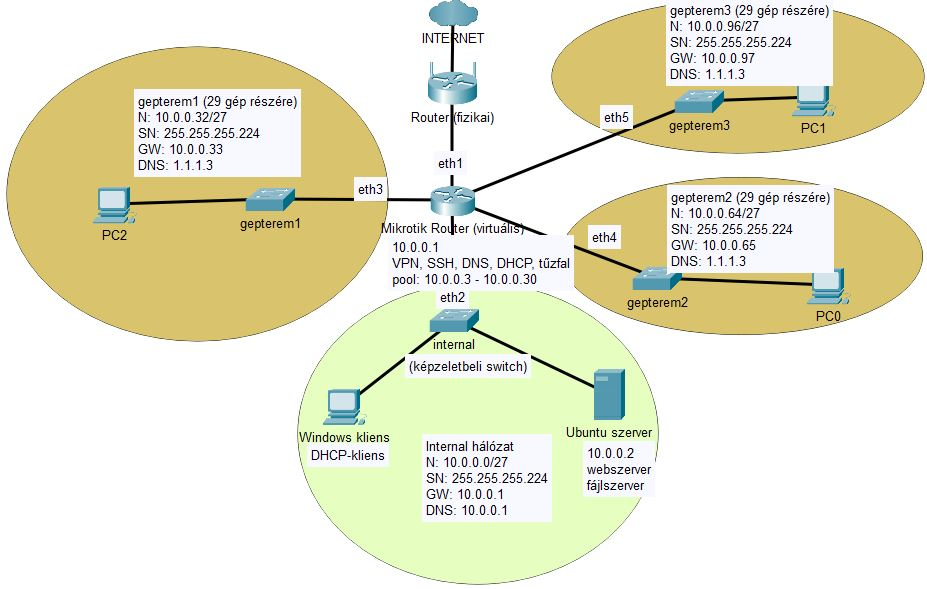
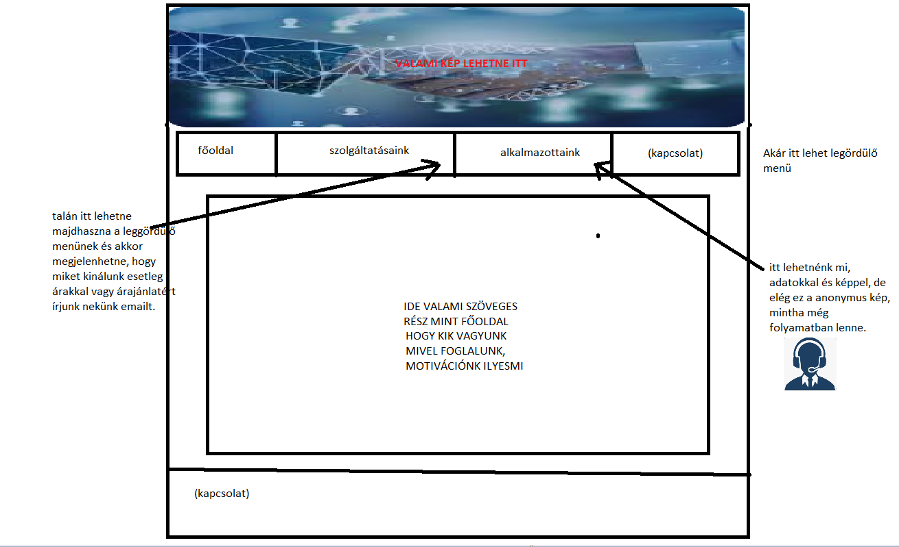
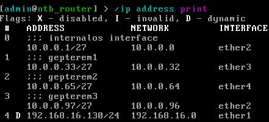
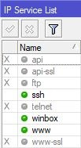
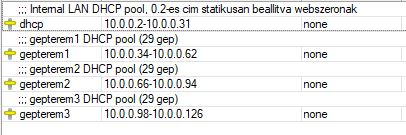
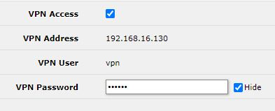
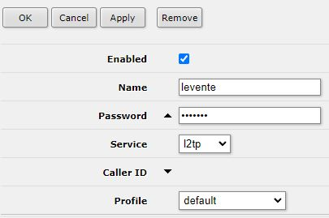
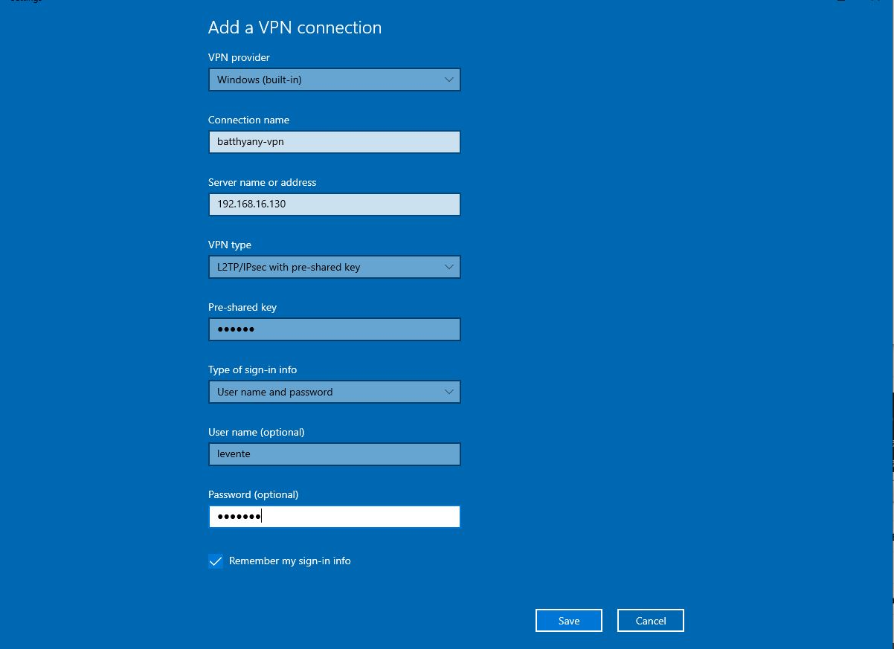
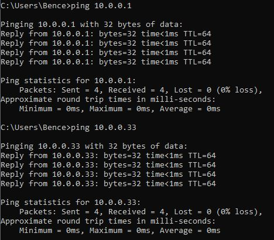

<h2> Linux fájlszerver központi felhasználó kezeléssel, webszolgáltatás honlappal, levelezés</h2>

**<center>Szerzők: Sipos Levente, Gajdos György és <br> Nagy-Tóth Bence</center>**

---

## Tartalomjegyzék

1.1 [Szöveges leírás](#spec)<br>
1.2 [Használati esetek](#use)<br>
1.3 [Követelménylista](#req)<br>
2.1 [Szoftverválasztás](#sel)<br>&emsp;
2.1.1 [Internetszolgáltatás kiválasztása](#sel-1)<br>&emsp;
2.1.2 [Router típusának kiválasztása](#sel-2)<br>&emsp;
2.1.3 [Szerver operációs rendszer kiválasztása](#sel-3)<br>&emsp;
2.1.4 [Webszerver kiválasztása](#sel-4)<br>&emsp;
2.1.5 [Fájlszerver kiválasztása](#sel-5)<br>
2.2 [Rendszerterv vázlat](#sys)<br>
2.3 [Hálózati terv](#net)<br>&emsp;
2.3.1 [Router terv](#net-1)<br>&emsp;
2.3.2 [IP-címzési terv](#net-2)<br>&emsp;
2.3.3 [Tűzfal-beállítások](#net-3)<br>
2.4 [Szerver tervezése](#serv)<br>&emsp;
2.4.1 [Fájlszerver terv](#serv-1)<br>&emsp;
2.4.2 [Levelezőszerver terv](#serv-2)<br>&emsp;
2.4.3 [Webszerver terv](#serv-3)<br>&emsp;
2.4.4 [Elérhető weboldalak](#serv-4)<br>&emsp;
2.4.5 [Felhasználói csoportok kialakítási terve](#serv-5)<br>
2.5 [Kliens tervezése](#cli)<br>
2.6 [Tesztelési terv](#testp)<br>
3 [Megvalósítás](#imp)<br>&emsp;
3.1 [Hálózat](#imp-1)<br>&emsp;
3.2 [Webszerver](#imp-2)<br>&emsp;
3.3 [Fájlszerver](#imp-3)<br>&emsp;
3.4 [Levelezőszerver](#imp-4)<br>&emsp;
4 [Tesztelés](#test)<br>
5 [Csapattagok](#mem)<br>

## 1.1. Szöveges leírás <a id="spec"></a>

Feladatunk a Battyhyány Lajos Gimnázium (fiktív iskola) informatikai rendszerének megteremtése. Az intézmény igazgatója tisztelt meg minket ezen munka megtervezésével és kivitelezésével. Az informatikai rendszer magában fogja foglalni egy internethálózat kiépítését, a belső hálózat megtervezését, egy fájlszerver, webszerver és egy levelezőszerver felépítését és üzemeltetését, valamint a kért kliensek és szerverek használatához szükséges operációs rendszerek telepítését, ennek megfelelő szoftveres és hardveres erőforrások biztosítását. Ezek mellett fontos, hogy az iskola hálózatát megfelelő minőségű védelemmel (tűzfal, jogosultsági rendszerek) is ellássuk.

Levelezőszolgáltatás telepítése feltétlenül szükséges, mivel korábban semmilyen levelezőszolgáltatás nem volt telepítve, a dolgozók kívánt konkrét e-mail azonosítóját az iskola gazdasági osztálya szerzi be. Arra viszont igény lenne, hogy minden kliens számítógépre kerüljön fel egy levelezőkliens, hogy így
kényelmesebb legyen a levelek kezelése.

## 1.2 Használati esetek <a id="use"></a> **todo**

táblázat jön ide

## 1.3 Követelménylista <a id="req"></a>

| Komponens       | Elvárás                                                                                                                     |
| --------------- | --------------------------------------------------------------------------------------------------------------------------- |
| Fájlszerver     | Bejelentkezési lehetőség biztosítva legyen                                                                                  |
| Fájlszerver     | Legyenek adottak a következő felelősségi körök: közös, hallgatók, tanárok, gazdasági                                        |
| Hálózat         | VPN-kapcsolat távoli csatlakozás esetére a karbantartó részére                                                              |
| Hálózat         | Webszerverhez távoli kapcsolat a fejlesztők részére                                                                         |
| Hálózat         | 5 teremnek megfelelő, kiosztható alhálózat biztosítása                                                                      |
| Hálózat         | A webszerver címe, elérhetősége ne változzon                                                                                |
| Levelezőkliens  | A levelezőkliens minden gépre legyen feltelepítve.                                                                          |
| Levelezőkliens  | A kliens egyszer letölti az emailt, és eldobja                                                                              |
| Levelezőszerver | Legfeljebb 50 klienst szolgáljon ki egyidőben érezhető lassulás nélkül                                                      |
| Monitorozás     | A szerver monitorozható erőforráskihasználtság (CPU, RAM, diszkek) szempontjából                                            |
| Webszerver      | A weboldalak legyenek publikusak,  bárki számára megtekinthetőek                                                            |
| Webszerver      | A webszerverhez tartozzon domain (tartománynév)                                                                             |
| Webszerver      | Legfeljebb 500 klienst szolgáljon ki egyidőben érezhető lassulás nélkül                                                     |
| Webszerver      | Legyen az iskola elérhetőségeit tartalmazó oldal                                                                            |
| Webszerver      | Legyen felvételi tájékoztató oldal                                                                                          |
| Webszerver      | Legyen egy bemutatkozó oldala az iskolának                                                                                  |
| Üzemeltetés     | Telefonos elérhetőség és távoli  számítógépes kapcsolat szükséges lehet az iskola dolgozói számára munkaidőben (8:00-16:00) |
| Üzemeltetés     | Ha meghibásodik egy hardverelem, akkor az legyen megjavítva/cserélve.                                                       |
| Fájlszerver     | A felelősségi köröknek megfelelően a közös mappát mindenki láthassa                                                         |
| Fájlszerver     | A felelősségi köröknek megfelelően a hallgatók mappát csak a hallgatók láthassák                                            |
| Fájlszerver     | A felelősségi köröknek megfelelően a tanárok mappát csak a tanárok (igazgató is tanárként lesz regisztrálva) láthassa       |
| Fájlszerver     | A felelősségi köröknek megfelelően a gazdasági mappát csak a gazdasági csoport tagjai láthassák                             |
| Hálózat         | Csak egy DHCP-szerver legyen, az szolgáljon ki minden címet                                                                 |
| Hálózat         | Ne legyen IP címütközés                                                                                                     |
| Hálózat         | Legyen fenntartva hely a statikus IP-címeknek                                                                               |
| Hálózat         | A nyomtató kapjon statikus IP-címet                                                                                         |
| Hálózat         | A webszerver kapjon statikus IP-címet                                                                                       |
| Hálózat         | A kapott IP-címtartománnyal optimálisan gazdálkodjunk                                                                       |
| Hálózat         | A hálózat legyen bővíthető újabb alhálózatokkal (skálázhatóság)                                                             |
| Hálózat         | Internet elérhetőség biztosítása minden iskolai résztvevő számára                                                           |

## 2.1 Szoftverválasztás <a id="sel"></a>

### 2.1.1 Internetszolgáltatás kiválasztása <a id="sel-1"></a>

A Magyarországon üzemelő internetszolgáltatók közötti választási lehetőségeket az iskola elhelyezkedése korlátozza. Ennek megfelelően két internetszolgáltatót találtunk, akiknek a környéken lefedettségük van.

A lehetőségek a következők:
Szolgáltató | Csomag | Garantált letöltési sebesség | Garantált feltöltési sebesség | Bruttó havidíj | Saját beüzemelési lehetőség | elektronikus számla (e-Pack kedvezmény)
------------|---------|------|------|-----|-----|----
Vodafone | Internet 150 | 105 Mbit/s | 7 Mbit/s | 3000 Ft/hó | van | igen
Vodafone | Internet 300 | 210 Mbit/s | 14 Mbit/s | 5000 Ft/hó | van | igen
Digi | DIGINet Növekedés 100 | 90 Mbit/s | 60 Mbit/s | 5040 Ft/hó | nincs | igen
Digi | DIGINet Növekedés 500 | 300 Mbit/s | 100 Mbit/s | 6230 Ft/hó | nincs | igen

A szolgáltató által bevezetett internetes kábelt ajánlott egy WiFi-szórásra egyaránt képes router eszközhöz csatlakoztatni, így a vezetékes hálózat mellett a vezeték nélküli hálózatot is kiépíthetünk az iskolában, amennyiben erre igény van. A vezeték nélküli hálózat lefedettsége azonban korlátozott, az előbb ismertetett Mikrotik router esetében 10 méter. Ahhoz, hogy a teljes iskola épületét lefedjük, szükség lehet bizonyos helyiségben lehetőleg szintén Mikrotik márkájú jelismétlőket, hozzáférési pontokat kihelyezni, hogy az iskola legtöbb pontján stabil jelerősséget és internetelérést kapjunk.

A fenti táblázat alapján részünkről a második lehetőség optimális lehet, ez név szerint a Vodafone Internet 300-as csomagja.

### 2.1.2 Router típusának kiválasztása <a id="sel-2"></a>

Routerre azért van szükségünk, hogy az iskolai belső hálózatot az internetre csatlakoztassuk. Amennyiben egy géptermet vagy egy másik hálózati egységet szeretnénk leválasztani az internetről, természetesen erre is lehetőséget biztosít egy router.

A választott internetszolgáltató alapértelmezés szerint biztosítana router eszközt, de ezt érdemes lemondani, mi fogjuk biztosítani ezt az eszközt.

Jelenlegi raktárkészletünknek megfelelően az alábbi eszközök közül tudnak választani:
| Router márkája | Előnyei | Hátrányai |
| -------------- | ---------------------------------------------------------------------------------------------------------------- | ----------------------------------------------------------------------------------------------------------------------------------------------------------------------------------------------- |
| Cisco | felsőbb árkategória, ipari szabvány, rengeteg leírás található a beállításához, jelentős felhasználói bázisa van | drága, inkább nagyvállalati környezetben ajánlatos telepíteni, beállítása parancssori alkalmazáson keresztül történik, telepítése, üzemeltetése ebből fakadóan külön erre specializált szakértelmet igényel |
| Mikrotik | megfizethetőbb vállalati megoldások, kis- és középvállalati felhasználásra alkalmas, beállítása nem igényel akkora szaktudást | nagyszabású hálózati felépítéshez nem annyira alkalmas, korlátozott fejlesztői és felhasználói támogatással és erőforrásokkal rendelkezik |
| Tenda | olcsóbb, alsó árketegóriás eszközök | konfigurálhatósága, személyre szabhatósága gyengébb, mint az előbb felsoroltaké |

Ugyanakkor fontos megjegyezni, hogy a router egy támadási felület, úgyhogy a biztonság szempontjából mindenképp egyetlen routert ajánlatos beszerezni, az ajánlott, a lehetőségeknek megfelelő védelmi beállításokat elvégezni rajta, és a belső hálózatot switchekkel, vezetéknélküli access pointokkal (AP-kal) bővíteni.

### 2.1.3. Szerver operációs rendszer kiválasztása <a id="sel-3"></a>

A webszerver minimális, statikus weboldalakkal fog üzemelni, nem lesz szükség adatbázisszerver futtatására. Ebből fakadóan a kért fájl- levelező- és webszerver üzemeltethető egy számítógépen. Az erőforrások megfelelő kihasználása végett érdemes lehet a különféle szervereket külön virtuális gépekre telepíteni (lényegében ekkor is egy fizikai szervergépre lenne szükség), azonban ezt jelenleg nem tartjuk indokoltnak.

A szervergépen futó operációs rendszerre a különböző lehetőségek állnak rendelkezésre:

| Operációs rendszer  | Előnyök                                                                                                                                     | Hátrányok                                                                                                            |
| ------------------- | ------------------------------------------------------------------------------------------------------------------------------------------- | -------------------------------------------------------------------------------------------------------------------- |
| Ubuntu Linux        | ingyenes, gyakori frissítéseket kap,                                                                                                        | a telepítés akár egy napot is igénybe vehet                                                                          |
| Windows Server 2022 | a webszerver, levelezőszerver telepítése gyors                                                                                              | fizetős (egyszeri költség)                                                                                           |
| CentOS Linux        | ingyenes, kevesebb erőforrással fut, gyakori frissítések, stabil (az alkalmazásokat elég ritkábban frissíteni), hasznos biztonsági funkciók | nehézkesebb használat: ha egy alkalmazás legfrissebb változatát szeretnénk telepíteni, azt manuálisan kell elvégezni |

Mivel az anyagi források egy középiskola esetében erősen korlátozottak, ezért az ingyenessége végett Ubuntu Linux operációs rendszert ajánljuk.

### 2.1.4. Webszerver kiválasztása <a id="sel-4"></a>

| webszerver | előnyök                                                                                                 | hátrányok                                                                                                                                                  |
| ---------- | ------------------------------------------------------------------------------------------------------- | ---------------------------------------------------------------------------------------------------------------------------------------------------------- |
| Apache     | ingyenes, beállítása egyszerű                                                                           | kevés funkció, kevés biztonsági beállítás található meg benne                                                                                              |
| Nginx      | ingyenes, gyorsabb töltési idő, nagyobb teljesítmény, lightweight: kevesebb erőforrást igényel a géptől | egyetlen konfigurációs fájl, kevésbé rugalmas, a fejlesztett modulok felett nincs irányításunk (nem lehet letiltani modulokat), kisebb közösségi támogatás |
| XAMPP      | ingyenes                                                                                                | egy egész fejlesztői csomag telepítését vonja maga után, ami felesleges, biztonsági beállítások hiánya                                                     |

### 2.1.5 Fájlszerver kiválasztása <a id="sel-5"></a>

| Fájlszerver típusa | Előnyök                                                                                                                                                                                                                            | Hátrányok                                                                                                                                            |
| ------------------ | ---------------------------------------------------------------------------------------------------------------------------------------------------------------------------------------------------------------------------------- | ---------------------------------------------------------------------------------------------------------------------------------------------------- |
| Samba              | Erős biztonsági funkciókat biztosít<br>Támogatja a Windows, Linux és macOS rendszerek közötti platformok közötti fájl- és nyomtatómegosztást. Heterogén/multiplatform környezetekhez tökéletes<br>Integrálható Active Directoryval | a natív Windows fájlmegosztáshoz képest kissé lassabb teljesítményt tapasztalhatunk                                                                  |
| NFS                | Unix/Linux hálózatokon belüli egyszerű fájlmegosztás, megerősített biztonsági funkciók                                                                                                                                             | nehezebb konfigurálni<br>korlátozott platform támogatás (Unix-alapú rendszerek)                                                                      |
| FTP                | Különböző platformokkal kompatibilis, Fájlok nyilvános elérésének biztosítására vagy fájlok távoli helyek közötti átvitelére alkalmas.                                                                                             | néhány funkció hiányzik belőle a zökkenőmentes integrációhoz (hozzáférés-kezelés hiányos)<br>A biztonság korlátozott, különösen a régebbi verziókban |

## 2.2 Rendszerterv vázlat <a id="sys"></a>

| Komponens típusa                           | Választott komponens                         |
| ------------------------------------------ | -------------------------------------------- |
| Internetszolgáltató                        | Vodafone                                     |
| Internetszolgáltatótól kért internetcsomag | Internet 300                                 |
| Adatbázis szerver                          | nincs, statikus adatokkal működik a weboldal |
| Webszerver                                 | Apache                                       |
| Webszerver operációs rendszere             | Ubuntu Linux 22.04                           |
| Fájlszerver                                | SMB                                          |
| Fájlszerver operációs rendszere            | Ubuntu Linux 22.04                           |
| Levelezőszerver                            | Dovecot                                      |
| Levelezőszerver operációs rendszere        | Ubuntu Linux 22.04                           |
| Kliens számítógépek operációs rendszere    | Windows 11 Home                              |
| Telepíteni kívánt levelezőkliens           | Microsoft Outlook                            |
| Telepíteni kívánt webböngésző              | Microsoft Edge                               |

## 2.3 Hálózati terv <a id="net"></a>

### 2.3.1 Router terv <a id="net-1"></a>

Egy Mikrotik routert szeretnénk bekonfigurálni a feladatnak megfelelően, a router tűzfalat, DHCP-, valamint DNS-szervert biztosítana a belső hálózat (továbbiakban: LAN, vagy Internal, 10.0.0.0/27) számára, valamint a belső hálózatban lévő virtuális gépek részére átjáró az internet felé.

A Mikrotik router konfigurációját a RouterOS operációs rendszerben kívánjuk elvégezni, magát a routert virtuális géppel fogjuk szimulálni.

### 2.3.2 IP-címzési terv <a id="net-2"></a>

- Internal (belső) hálózat: 10.0.0.0/27
- Alhálózati maszk: 255.255.255.224
- Hálózat nagysága: 30 host
- Gateway/Mikrotik router, egyben DNS és DHCP-szerver címe: 10.0.0.1
- Web- és fájlszerver (Ubuntu): 10.0.0.2
- Kliens: DHCP [10.0.0.3 ; 10.0.0.31] tartományból



### 2.3.3 Tűzfal-beállítások <a id="net-3"></a>

- RouterOS-ben alapértelmezett portok átállítva (www, ssh)
- a felesleges portokat kikapcsoljuk (api-ssl, ftp, telnet, www-ssl)
- alapvetően minden port zárt, amíg annak megnyitását valami nem indokolja
- port forwarding: router 80-as (HTTP, majd később akár 443-as, HTTPS) portjára érkező kéréseket átirányítom az Internal webszerverének megfelelő portjára (8080)

Amennyiben szükség lenne VPN-kapcsolatra a webszerver konfigurálásához, azt a Mikrotik routeren szintén beállítjuk.

## 2.4 Szerver tervezése <a id="serv"></a>

### 2.4.1 Fájlszerver terv <a id="serv-1"></a>

- Samba fájlszerver, ami lehetőséget ad egy kliens gép számára, hogy hozzáférjen a fájlszerverhez.:
  - [Dokumentáció](https://ubuntu.com/server/docs/samba-file-server)
- Samba telepítése:
  - sudo apt install samba
- Felhasználók felvétele:
  - smbpasswd -a user
  - groupadd -g 501 tanarok
  - groupadd -g 502 gazdasagi
  - groupadd -g 500 kozos
- Csoport mapppa létrehozása, és jogosultság hozzáadása(példa a "tanarok" csoporttal):
  - mdkir -p /var/fileServer/tanarok
  - chgrp tanarok /var/fileServer/tanarok
  - chmod 660 /var/fileServer/tanarok

A Samba fájlszerver az **SMB** hálózati protokollt használja.

### 2.4.2 Levelezőszerver terv <a id="serv-2"></a>

POP3 protokollt fogjuk használni a levelek fogadásához a hatékonyabb biztonság érdekében, mivel az email csak egyetlen kliensgépre töltődik le.
A levelek küldésére az SMTP protokoll fog működni.
Az Ubuntu szerveren a Dovecot nevű alkalmazást használjuk a levelezőszerver konfigurálásához.

[Dovecot Dokumentáció](https://ubuntu.com/server/docs/mail-dovecot)

### 2.4.3 Webszerver terv <a id="serv-3"></a>

- Maga a webszolgáltatás Linux alapon Ubuntu-n készül, melyen belül Apache(2) webszolgáltatás lesz telepítve.
- Apache telepítése:
  - sudo apt install apache2
- html fájl helye:
  - /var/www
- Szerver aktiválása:
  - sudo a2ensite <conf fájl>
- Portok config fájljának a helye:
  - /etx/apache2/ports.conf
- A szerverhez tartozó html fájlokat a /var/www/szero mappában találjuk meg.

Az Apache webszerver a 8080-as porton fut, várja a kéréseket.

A webszer alapvetően statikus tartalmú HTML-állományokat fog hosztolni dinamikus útvonalak nélkül, ezért az Apache szerveren kívül másra esetünkben nincs szükség.

### 2.4.4 Elérhető weboldalak <a id="serv-4"></a>

Egy iskolának a weboldalát kívánjuk létrehozni, mely a következő elképzelések alapján valósul meg. A weboldal megnyitása követően egy Kezdőlap/Főoldal jelenik, ahol egy rövid leírás található magáról az iskoláról, illetve az elért sikereiről.



A weboldalon található egy menüsáv, ahol a felhasználó könnyen tud tájékozodni a felületen. A menüsávban megtalálhatóak a **Kezdőlap**, **Felvételi**, **Tantárgyak**, **Magunkról**, **Kapcsolat** pont.

A **Felvételi** oldalon lehet tájékozodni a szülőknek és a diákoknak, hogy mire érdemes oda figyelni, illetve a követelményeket is tudják megtekinteni.

A **Tantárgyak** oldalon látják a felhasználók, hogy milyen tantárgyakat oktatnak az adott iskolában és kik lehetnek a diákok tanáraik.

A **Magunkról** oldalon lehet megtekinteni, az iskola bemutatkozását, illetve mire a legbüszkébb. Szintén itt lehet megtekinteni a korábbi eseményekről történt videókat, mint például a Magyar költészet napja vagy Sportnap és a házirend is itt érhető el.

A **Kapcsolat** oldalon találhatóak az iskola elérhetősége, mint például cím, telefon és OM azonosítója és ez alatt egy google térkép ablak, ahol külön keresés nélkül lehet megtekinteni az iskola pontos helyét.

A weboldaltervet Gajdos György készítette el.

### 2.4.5 Felhasználói csoportok kialakítási terve <a id="serv-5"></a>

Alapvetően háromféle felhasználói csoportot különböztetünk meg:

- Gazdasági: gazdasági iroda dolgozóinak csoportja
- Tanárok: iskola oktatóinak csoportja
- Közös: tanárok, diákok, gazdasági iroda közös csatornája

## 2.5 Kliens tervezése <a id="cli"></a> **todo**

## 2.6 Tesztelési terv <a id="testp"></a>

| Teszt azonosító | Tesztelés tárgya<br>(mit teszteltünk)                                         | Elvárt eredmény | Megjegyzés                                                  |
| --------------- | ----------------------------------------------------------------------------- | --------------- | ----------------------------------------------------------- |
| NET_01          | Router elérése WinBoxban                                                      | Sikeres         | elrontott portkonfigurációkat vissza tudjuk hozni Winboxban |
| NET_02          | Router konfigurációs felületének elérése 80-as porton keresztül               | Sikertelen      | hardeninget teszteljük                                      |
| NET_03          | Router konfigurációs felületének elérése a beállított porton keresztül        | Sikeres         | hardeninget teszteljük                                      |
| NET_04          | Router elérése SSH-val 22-es porton keresztül                                 | Sikertelen      | hardeninget teszteljük                                      |
| NET_05          | Router elérése SSH-val a beállított porton keresztül                          | Sikeres         | hardeninget teszteljük                                      |
| NET_06          | Router elérése Telnettel                                                      | Sikertelen      | hardeninget teszteljük                                      |
| NET_07          | Routerre fájlokat juttatunk FTP protokoll segítségével                        | Sikertelen      | hardeninget teszteljük                                      |
| NET_08          | Router elérése WinBoxban, külső hálózatról                                    | Sikertelen      | hardeninget teszteljük                                      |
| NET_09          | Webszerver elérése SSH-val a routeren keresztül (port forwarding)             | Sikeres         | tűzfalbeállításokat teszteljük                              |
| NET_10          | Iskola honlapjának elérése a routeren (gatewayen) keresztül (port forwarding) | Sikeres         | tűzfalbeállításokat teszteljük                              |
| NET_11          | DHCP-vel IP-konfigurációk kiosztása 29 géptermi gép részére                   | Sikeres         | DHCP-szerver konfigurációját teszteljük                     |
| NET_12          | DHCP-vel IP-konfigurációk kiosztása egy újabb, 30. gép részére                | Sikertelen      | DHCP-szerver konfigurációját teszteljük                     |
| NET_13          | webszerver 10.0.0.2 címet kapja DHCP-szervertől                               | Sikeres         | DHCP-szerver konfigurációját teszteljük                     |
| NET_14          | az Internal belső hálózat gépei a 10.0.0.2-31 tartományból kapnak címeket     | Sikeres         | DHCP-szerver konfigurációját teszteljük                     |
| NET_15          | a gepterem1 belső hálózat gépei a 10.0.0.34-62 tartományból kapnak címeket    | Sikeres         | DHCP-szerver konfigurációját teszteljük                     |
| NET_16          | a gepterem2 belső hálózat gépei a 10.0.0.66-94 tartományból kapnak címeket    | Sikeres         | DHCP-szerver konfigurációját teszteljük                     |
| NET_17          | a gepterem3 belső hálózat gépei a 10.0.0.98-126 tartományból kapnak címeket   | Sikeres         | DHCP-szerver konfigurációját teszteljük                     |
| NET_18          | gepterem1 és gepterem2 gépei elérik egymást (ping)                            | Sikeres         | Subnetting konfigurációt teszteljük                         |
| NET_19          | gepterem2 és gepterem3 gépei elérik egymást (ping)                            | Sikeres         | Subnetting konfigurációt teszteljük                         |
| NET_20          | Internal és gepterem1 gépei elérik egymást (ping)                             | Sikeres         | Subnetting konfigurációt teszteljük                         |
| NET_21          | VPN-re kapcsolódhatunk 'levente' felhasználóval                               | Sikeres         | VPN konfigurációját teszteljük                              |
| NET_22          | VPN kapcsolat  'levente' felhasználóval L2TP-től eltérő protokollal           | Sikertelen      | VPN konfigurációját teszteljük                              |
| NET_23          | VPN-kapcsolat közben gateway pingelése                                        | Sikeres         | VPN konfigurációját teszteljük                              |
| NET_24          | VPN-kapcsolat közben 8.8.8.8 pingelése                                        | Sikeres         | VPN konfigurációját teszteljük                              |
| NET_25          | VPN-kapcsolat közben ssh 10.0.0.2 gépre (webszerverre)                        | Sikeres         | VPN konfigurációját teszteljük                              |

## 3. Megvalósítás <a id="imp"></a>

A következő alfejezet a fentebb említett tervezet konkrét megvalósítási részleteiről fog szólni, a különböző problémákról, amelyekbe ütköztünk, valamint ezek megoldásáról, megoldására tett kísérletekről.

### 3.1 Hálózat megvalósítása <a id="imp-1"></a>

A Mikrotik router konfigurációját Nagy-Tóth Bence végezte. 5 db interfészt kapcsoltunk a Mikrotik routerre, ezek a következőképpen vannak kiosztva:

#### Interfészek

- **ether1**: külső elérésre, az internetszolgáltató felé néző interfész, lényegében ez az egyetlen kiút/gateway az iskolából külvilág felé, az internetes böngészést így kipipáltuk
- **ether2**: a router Internal LAN-hálózat felé néző interfésze, ennek felhasználását az iskolára bíztuk, valószínűleg egy tanári szoba hálózati forgalmát fogja kezelni
- **ether3**: a router gepterem1 LAN-hálózata felé néző interfésze, az 1-es gépterem gépeit tervezzük hálózatba kapcsolni ezen keresztül
- **ether4**: a router gepterem2 LAN-hálózata felé néző interfésze, a 2-es gépterem gépeit tervezzük hálózatba kapcsolni ezen keresztül
- **ether5**: a router gepterem3 LAN-hálózata felé néző interfésze, a 3-as gépterem gépeit tervezzük hálózatba kapcsolni ezen keresztül

Az alábbi ábrán látható, hogy melyik interface melyik hálózatra van kötve, és hogy az adott LAN-hálózaton belül mely címen szolgál ő gatewayként.


#### Megtett hardening lépések

Alapvető biztonsági beállítások sorozatát végeztük el, az alapértelmezett jól ismert portokat (HTTP=80, SSH=22) átírtuk. Jelenleg a router úgy működik, hogy kívülről a router elérhető a 80-as porton, viszont átirányít az Internal hálózat webszerverére, így lényegében publikussá tettük az iskola honlapját, ami így a router publikus, internetszolgáltatótól kapott címén keresztül, a HTTP jól ismert 80-as portján keresztül el is érhető. A router kifelé néző, 22-es portját a webszerver üzemeltetője és a webfejlesztők használhatják arra, hogy SSH-hozzáférést nyerjenek a webszerverhez, így azt futás közben tudják módosítani. Természetesen ehhez autentikálniuk kell magukat.
További portokat az igényeknek megfelően megnyithatunk a routeren, de a jelenleg feleslegesnek megítélt portokat zárva tartjuk.

A router konfigurációs felülete elérhető webböngészőből, ezt viszont csak a rendszeradminisztrátor tudhatja biztonsági okokból. Ezenkívül a Winbox programot futtatva a rendszeradminisztrátor egy másik, alternatív módon is használni tudja a konfigurációs felületet.



A DHCP szerver úgy fog működni, hogy az Internal és a 3 gépterem LAN-hálózatának oszt ki címeket a következőképpen:

- Internal: 10.0.0.2-30 tartományban oszt ki címeket, ez 29 címet jelentene, viszont egyrészt 10.0.0.2 az iskola webszervere fog futni, másrészt a 10.0.0.3-ra valószínűleg egy nyomtatót fognak csatlakoztatni az iskolában, szóval ténylegesen 27 címet tudunk kiszolgálni, ami az iskola tanárainak telefonjaiból, laptopjából, iskolai asztali számítógépeiből álló eszközparkot lefedheti.
- gepterem1: az 1-es gépterem gépei a 10.0.0.34-62 címtartományból fognak címeket kapni. A címtartomány 29 gépnek enged hálózati hozzáférést
- gepterem2: a 2-es gépterem gépei a 10.0.0.66-94 címtartományból fognak címeket kapni a gépterem gépei
- gepterem3: az 3-as gépterem gépei a 10.0.0.98-126 címtartományból fognak címeket kapni a gépterem gépei



#### VPN-elérés

VPN-elérést is megadtunk a webfejlesztőknek valamint a rendszergazdának, tehát így is el tudják érni a belső iskolai hálózat gépeit.



Jelenleg egy 'levente' nevű felhasználót adtunk meg egy hozzá tartozó jelszóval, így a kliens beállításakor VPN-nel ezekkel az ad beléphetünk az iskolai hálózatban L2TP (Layer 2 Tunneling Protocol) segítségével.
A VPN-kapcsolat Windowsban beállítható.


A kliens beállítása így történik egy iskolától távoli Windows 10 rendszeren (Settings>Network&Internet>VPN>Add VPN connection):


Amennyiben az otthoni számítógépen jól adtuk meg a felhasználói adatokat, a VPN-szerver címét (ami a router publikus IP-címe vagy amennyiben van, domain neve), és az úgynevezett pre-shared key-t (egy jelszó, ami a VPN elkészítésekor lett megadva), akkor a csatlakozás sikeres lesz, így az iskola gépei elérhetővé válnak (amennyiben azok bekapcsolt állapotban vannak).

Az alábbi példában én az iskolai belső hálózatból 2 gateway-t pingeltem meg, és mivel ezek választ adtak, ezért lényegében így a belső hálózat bármelyik gépére be tudok jelentkezni tetszés szerint.
Ez megkönnyítheti a rendszergazda munkáját, élhet a távsegítség lehetőségével, amennyiben szoftveres probléma merülne fel az iskola valamely számítógépén.

A webfejlesztők SSH mellett így már VPN-nel is fel tudják tölteni a weboldal frissített változatát. Ha egyszerre több felhasználó is szeretne élni VPN nyújtotta lehetőségekkel, akkor a rendszergazda a RouterOS beállításaiban felvehet újabb felhasználókat.



### 3.2 Webszerver <a id="imp-2"></a>

A webszerver kialakítását Sipos Levente végezte. Apache-t használtunk a webszerver kialakításához:
A webszerver a 80-as porton érhető el, a "public.beadando.server" nevezetű domainen.
A weboldal működtetéséhez szükséges fájlok, statikus erőforrások (képek, dokumentumok) megtalálhatóak a "/var/www/szero" mappában. Lényegében az Apache ezekre az erőforrásokra vonatkozó kéréseket figyeli, és kiszolgálja HTTP-válaszok formájában.

### 3.3 Fájlszerver <a id="imp-3"></a> **todo**

A fájlszerver konfigurációját Sipos Levente végezte.

### 3.4 Levelezőszerver <a id="imp-4"></a>

A levelezőszervert Sipos Levente konfigurálta be.
Dovecot IMAP/POP3 Server-t használtunk a levelező szerver kialakítása érdekében.
Annak érdekében hogy ne kelljen az ip-címet használni a "@" után ezért egy domain nevet kellett létrehozni:
a domain amelyen keresztül tudunk levelezni: - public.mail.beadando
Majd a "mailutils" package feltelepítésével már tudunk emaileket küldeni különböző usereknek
Email küldése:

```bash
mail -s "test Email" <user>@public.mail.beadando
```

\<user\> ebben az esetben egy regisztrált felhasználója a levelezőszervernek.

## 4. Tesztelés <a id="test"></a> **todo**

## 5. Csapattagok <a id="mem"></a>

- Sipos Levente (Neptun-kód: D985ET)
- Gajdos György (Neptun-kód: AM7NTP)
- Nagy-Tóth Bence (Neptun-kód: DZKBX0)
